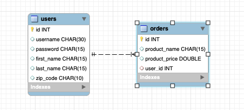

### Getting started
* Install and configure JDK 11
* Install and configure [Apache Maven 3.6.0+](http://maven.apache.org/)
* Download and start the latest [Selenium standalone server](http://www.seleniumhq.org/download/)
* Download the latest version of [Eclipse](http://www.eclipse.org/downloads/) and install [TestNG plugin](http://testng.org/doc/download.html)
* [Read Carina Cucumber documentation](https://zebrunner.github.io/carina/cucumber/)

### Import to Eclipse
If generation is successfully complete, you would see a new project folder with a name equal to the artifactId attribute specified during generation, so navigate to that folder (where pom.xml is located) and execute the following Maven task:
```
mvn clean eclipse:eclipse
```
By executing this command, Maven should resolve all dependencies, downloading required libraries to your local repository and generating Eclipse classpath. Before importing new project to Eclipse, you should link your IDE to your Maven repository by executing the following task:
```
mvn -Dworkspace=<path_to_workspace> eclipse:configure-workspace
```
Here you have to specify the absolute path to the Eclipse workspace. After that, restart Eclipse IDE. Now you can import generated projects such as "Existing Java Project" into Eclipse IDE.
Generate Eclipse workspace using command:
```
mvn clean eclipse:eclipse
```

### Run tests
```
mvn clean test -Dsuite=cucumber-web
```

## Implementation Details
1. Add dependencies to pom file
2. Create the feature file, should be stored in test/java/resources/features/ package and have .feature extension. Write down text of your scenario using cucumber syntax
3. Create the steps file under test>java>cucumber>steps directory. Declare each step of your scenario in Jave сode. To declare steps in Java you need to use cucumber annotations @Given, @When, @Then, etc.
4. Map text representation of scenario with Java classes describing it. You need to create test class and extend it from CucumberBaseTest carina class. Then use @CucumberOptions annotation in order to complete the mapping itself. Class body can be empty since all logic for building of scripts and running them is implemented inside CucumberBaseTest class.
5. Start selenium server session with command **java -jar selenium-server-4.18.1.jar standalone**
6. Run tests.
### Database

### MyBatis
1. For integration with DB, we recommend to use MyBatis ORM framework. Add the required dependencies into Maven pom.xml:
```
<dependency>
   <groupId>org.mybatis</groupId>
   <artifactId>mybatis</artifactId>
   <version>3.5.2</version>
</dependency>
<!-- MySQL driver -->
<dependency>
   <groupId>mysql</groupId>
   <artifactId>mysql-connector-java</artifactId>
   <version>8.0.17</version>
</dependency>
```
2. Place DB credentials into src/main/resources/_database.properties
```
#===============================================================#
#================== Database configuration ====================#
#===============================================================#
db.url=jdbc:postgresql://localhost:5432/postgres
db.driver=org.postgresql.Driver
db.user=postgres
db.pass=postgres

#db.url=jdbc:mysql://localhost:3306/mysql
#db.driver=com.mysql.jdbc.Driver
#db.user=mysql
#db.pass=mysql
```
3. All the mappers and reference to _database.properties should be specified in src/main/resources/mybatis-config.xml
4. Create a ConnectionFactory class, which will be responsible for MyBatis context initialization and creation of mapper instances